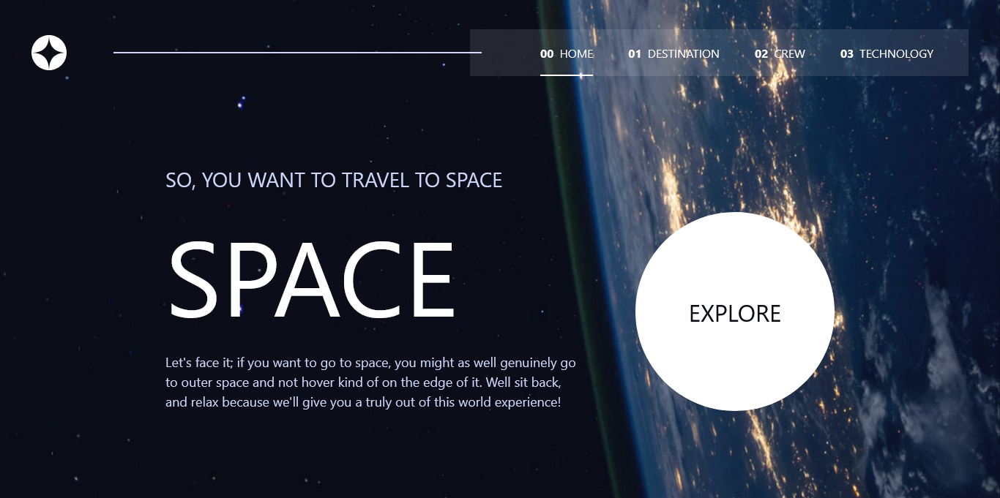
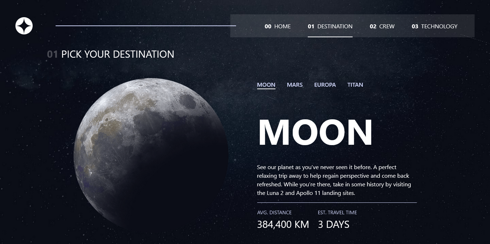
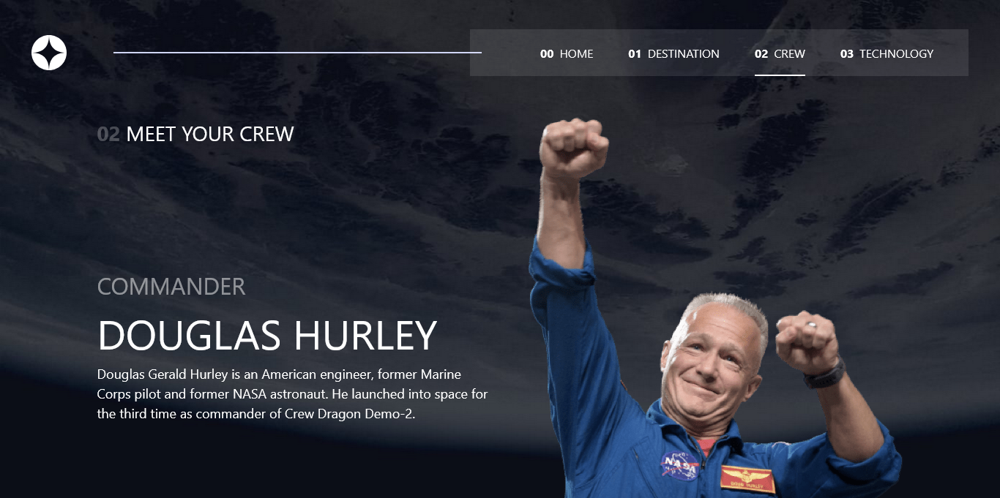
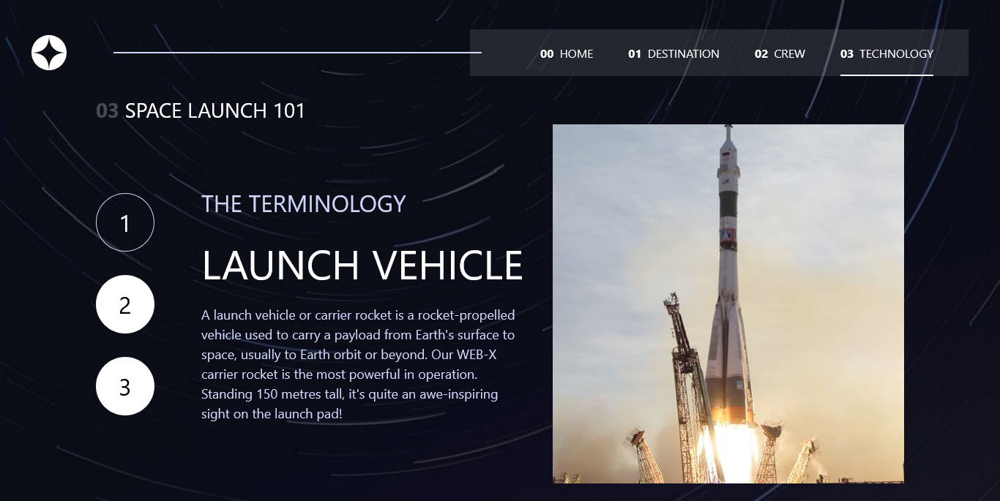

# Frontend Mentor - Space tourism website solution

This is a solution to the [Space tourism website challenge on Frontend Mentor](https://www.frontendmentor.io/challenges/space-tourism-multipage-website-gRWj1URZ3). Frontend Mentor challenges help you improve your coding skills by building realistic projects.

## Table of contents

-  [Overview](#overview)
   -  [The challenge](#the-challenge)
   -  [Screenshot](#screenshot)
   -  [Links](#links)
-  [My process](#my-process)
   -  [Built with](#built-with)
   -  [What I learned](#what-i-learned)
   -  [Useful resources](#useful-resources)
-  [Author](#author)

## Overview

### The challenge

Users should be able to:

-  View the optimal layout for each of the website's pages depending on their device's screen size
-  See hover states for all interactive elements on the page
-  View each page and be able to toggle between the tabs to see new information

### Screenshot

### Links

-  Solution URL: [Github](https://github.com/Oyeins-GUI/space-tourism)
-  Live Site URL: [Space tourism](space-tourism-with-oyeins.vercel.app)

## My process

### Built with

-  Semantic HTML5 markup
-  [React](https://reactjs.org/) - JS library
-  [Typescript](https://typescriptlang.org)
-  [React router dom](https://reactrouter.com/) - Lib for handling navigation
-  [Tailwindcss](https://tailwindcss.com/) - CSS framework

### What I learned

This project re-enforceed what I've known in the past. One thing I learnt with this project is working with a design system provided. Not that good with working with it yet but have gained some experience with it.

### Useful resources

-  [Tailwind](https://tailwindcss.com/) - This helped me wit configuring tailwind for this project and using tailwind in general

## Author

-  Website - [Opuene Oyeinbomo](https://github.com/Oyeins-GUI)
-  Frontend Mentor - [@Oyeins-GUI](https://www.frontendmentor.io/profile/Oyeins-GUI)
-  Twitter - [@oyeinbomo](https://www.twitter.com/oyeinbomo)
